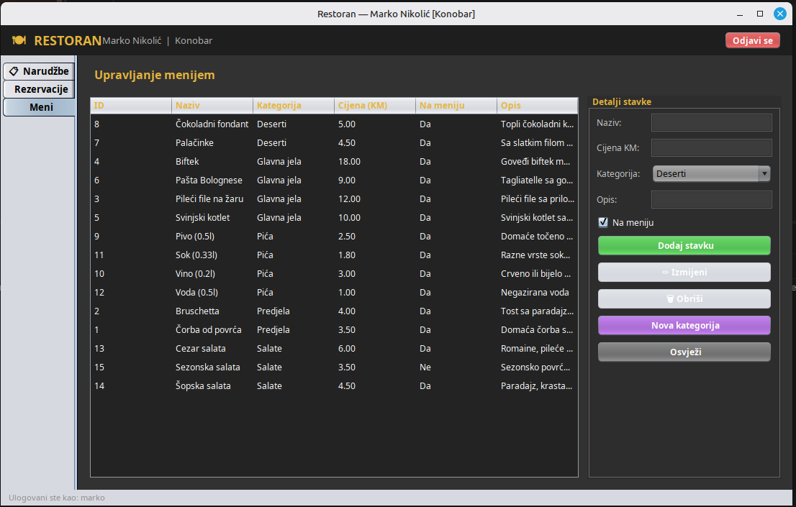
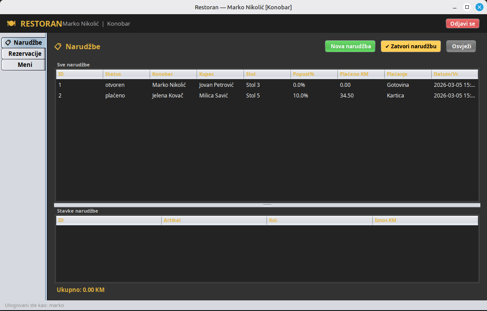
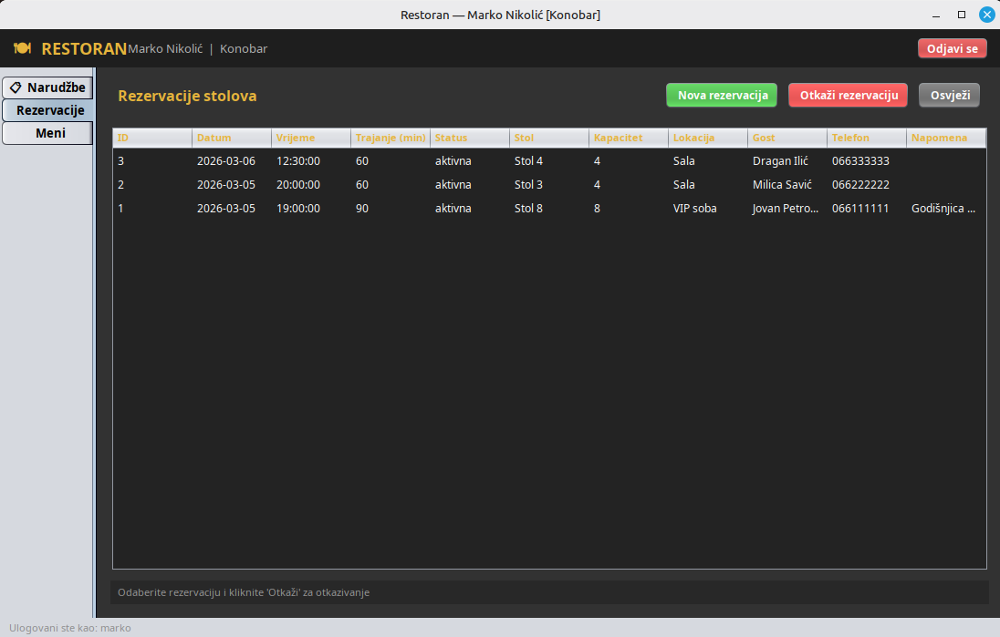
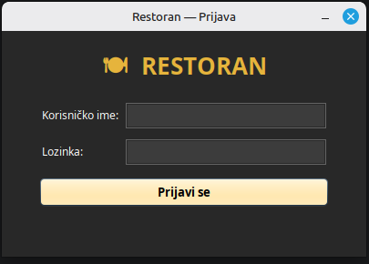

# 🍽️ Restoran — Restaurant Management System

> A full-featured desktop application for managing restaurant operations — orders, reservations, menu, staff, and inventory.


---

## 📋 Overview

**Restoran** is a desktop-based restaurant management system built with **Java Swing** and **MySQL**. It covers the full operational lifecycle of a restaurant — from taking orders and managing table reservations to tracking menu items, staff, and ingredient inventory.

The system features role-based access control, with business logic implemented entirely on the database layer through stored procedures, views, and triggers — ensuring a clean separation of concerns and consistent data integrity.

---

## ✨ Features

| Module | Description | Access |
|--------|-------------|--------|
| 🔐 **Login** | Secure authentication with role-based access | All |
| 📋 **Orders** | Create, view, add items, and close orders with automatic billing | All |
| 📅 **Reservations** | Manage table reservations and guest records | All |
| 🍕 **Menu** | Full CRUD for menu items and categories | All |
| 👥 **Staff** | Manage employees and roles | Manager only |

### Business Logic Highlights
- Tables automatically change status (free / reserved / occupied) via database triggers
- Order total is automatically calculated with discount applied on close
- Ingredient stock is tracked — decremented on order, incremented on purchase
- New guests can be registered directly from the reservation form
- Managers have full access; waiters see only operational modules

---

## 🏗️ Architecture

```
restoran/
├── db/
│   └── DatabaseConnection.java     # Singleton connection manager
├── model/
│   ├── Employee.java
│   ├── Item.java
│   ├── Order.java
│   ├── Reservation.java
│   ├── Customer.java
│   ├── LoggedUser.java             # Session state
│   └── ...
├── dao/
│   ├── AuthDAO.java
│   ├── EmployeeDAO.java
│   ├── ItemDAO.java
│   ├── OrderDAO.java
│   └── ReservationDAO.java
└── ui/
    ├── LoginForm.java
    ├── MainWindow.java
    ├── OrderPanel.java
    ├── ReservationPanel.java
    ├── MenuPanel.java
    └── EmployeePanel.java
```

**Pattern:** 3-layer architecture (Model → DAO → UI). No ORM — all database logic is handled through stored procedures and views, keeping the application layer thin and the data layer consistent.

---

## 🗄️ Database

### Tables (19)
`_table` · `category` · `customer` · `discount` · `employee` · `ingredient` · `item` · `itemhasingredient` · `order` · `ordereditem` · `payment` · `paymenttype` · `purchase` · `purchaseitemingredient` · `reservation` · `role` · `shift` · `supplier` · `user_account`

### Views (11)
`allaccounts` · `allcategories` · `allemployees` · `allingredients` · `allitems` · `allmenuitems` · `allorders` · `allpaymenttypes` · `allreservations` · `allsuppliers` · `freetables`

### Triggers (6)
| Trigger | Event | Effect |
|---------|-------|--------|
| `trg_order_set_table_occupied` | INSERT on `order` | Sets table → "occupied" |
| `trg_order_free_table` | UPDATE on `order` | Sets table → "free" on payment |
| `trg_reservation_set_table_reserved` | INSERT on `reservation` | Sets table → "reserved" |
| `trg_reservation_cancel_free_table` | UPDATE on `reservation` | Sets table → "free" on cancel |
| `trg_purchase_update_stock` | INSERT on `purchaseitemingredient` | Increments ingredient stock |
| `trg_ordereditem_decrease_stock` | INSERT on `ordereditem` | Decrements ingredient stock |

### Stored Procedures (20+)
`login_user` · `get_all_employees` · `add_employee` · `update_employee` · `delete_employee` · `get_all_items` · `add_item` · `update_item` · `delete_item` · `create_order` · `add_item_to_order` · `close_order` · `get_all_orders` · `ordered_items_by_order_id` · `get_all_reservations` · `add_reservation` · `cancel_reservation` · `add_customer` · `get_all_customers` · `get_all_roles` · `add_category` · `add_ingredient`

---

## 🚀 Getting Started

### Prerequisites
- Java JDK 17+
- MySQL Server 8.0+
- IntelliJ IDEA (or any Java IDE)
- [MySQL Connector/J 8.x](https://dev.mysql.com/downloads/connector/j/)

### 1. Clone the repository
```bash
git clone https://github.com/your-username/restoran.git
cd restoran
```

### 2. Set up the database
```bash
mysql -u root -p < sql/01_restoran_ddl.sql
mysql -u root -p < sql/02_restoran_views_triggers_procedures.sql
mysql -u root -p < sql/03_restoran_testni_podaci.sql
```

### 3. Configure the connection
Edit `src/restoran/db/DatabaseConnection.java`:
```java
private static final String URL      = "jdbc:mysql://localhost:3306/restoran?useSSL=false&serverTimezone=Europe/Sarajevo&allowPublicKeyRetrieval=true";
private static final String USERNAME = "root";
private static final String PASSWORD = "your_password";
```

### 4. Add MySQL Connector/J to IntelliJ
```
File → Project Structure → Libraries → + → Java → select mysql-connector-j-8.x.jar
```

### 5. Run
Launch `Main.java` as the main class.

---

## 🔑 Default Accounts

| Username | Password | Role | Access |
|----------|----------|------|--------|
| `admin` | `admin123` | Manager | Full access |
| `marko` | `marko123` | Waiter | Orders, Menu, Reservations |
| `jelena` | `jelena123` | Waiter | Orders, Menu, Reservations |

---

## Screenshots

> Menu — authenticated user



> Orders — authenticated user



> Reservations — authenticated user



> Login screen with guest preview option



---

## 🛠️ Tech Stack

| Layer | Technology |
|-------|------------|
| Language | Java 17 |
| UI Framework | Java Swing |
| Database | MySQL 8.0 |
| DB Connectivity | JDBC (MySQL Connector/J) |
| IDE | IntelliJ IDEA |

---

## 📁 Project Structure

```
restoran/
├── sql/
│   ├── 01_restoran_ddl.sql
│   ├── 02_restoran_views_triggers_procedures.sql
│   └── 03_restoran_testni_podaci.sql
├── src/
│   └── restoran/
│       ├── db/
│       ├── model/
│       ├── dao/
│       ├── ui/
│       └── Main.java
└── README.md
```

---

## 👤 Author

**AT95BL**
[GitHub](https://github.com/AT95BL)) · [LinkedIn]([https://linkedin.com/in/your-username](https://www.linkedin.com/in/andrej-tro%C5%BEi%C4%87-57957122b/))

---

## 📄 License

MIT License — feel free to use, modify, and distribute.
